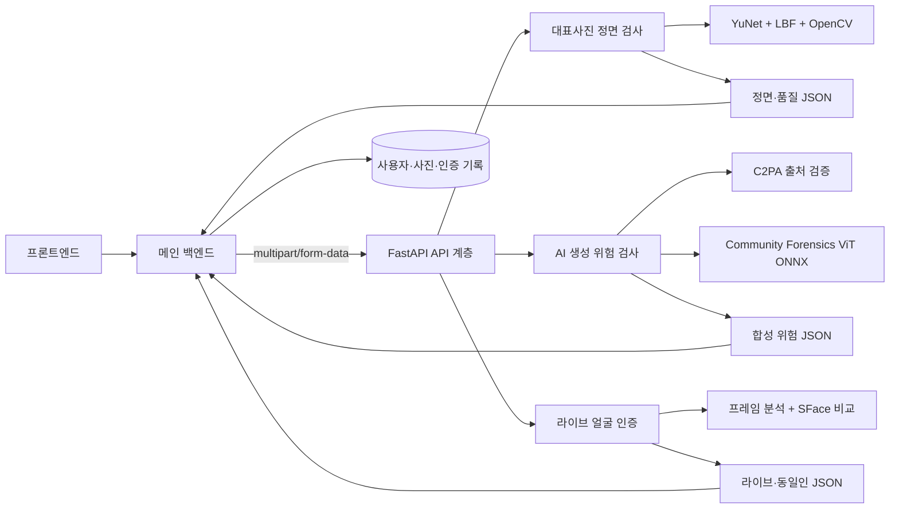
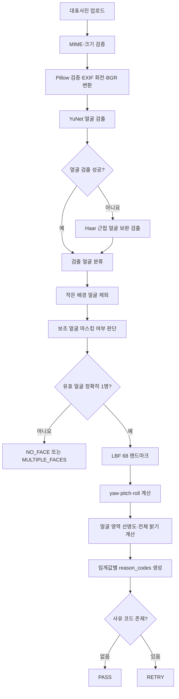
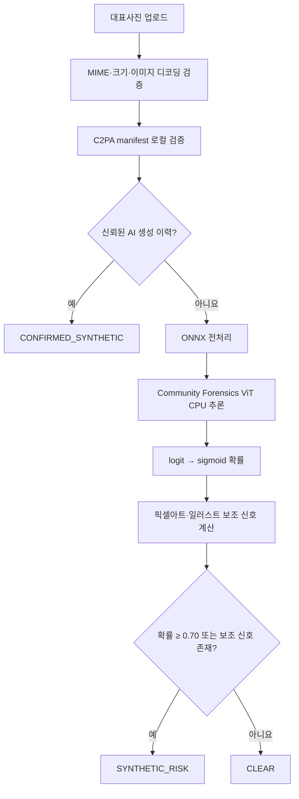
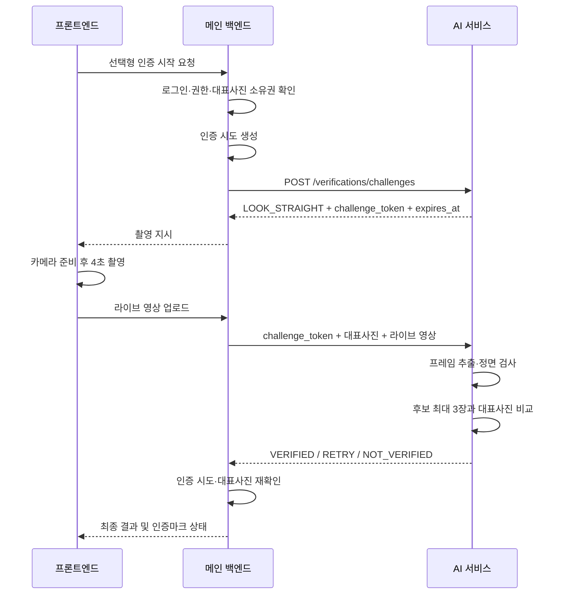
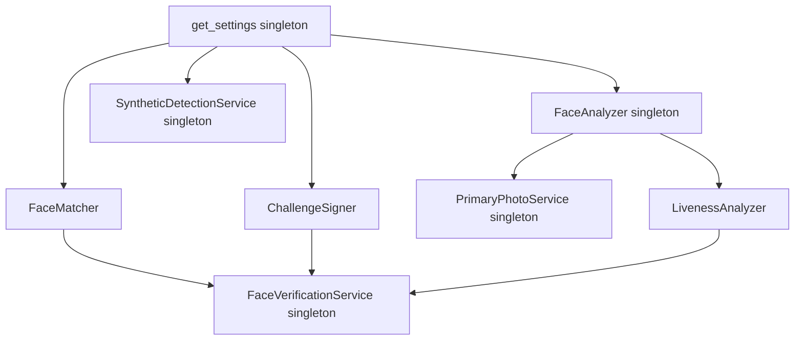

# Profile Trust AI 서비스 코드베이스 구조 및 처리 파이프라인 보고서

> 작성 기준일: 2026-10-05  
> 대상 경로: `V2_dev`  
> 기준 버전: 대표사진 정면 검사와 AI 생성 검사가 독립 API로 분리된 현재 코드

## 1. 문서 목적

이 문서는 Profile Trust AI 서비스가 어떤 구조로 구성되어 있고, 요청이 들어온 뒤 어떤 단계로 처리되며, 각 폴더와 파일이 어떤 책임을 가지는지 설명한다.

주요 독자는 다음과 같다.

- AI 기능을 연동하는 메인 백엔드 개발자
- 모델 또는 판정 기준을 수정하는 AI 개발자
- 테스트 화면과 API 결과를 확인하는 프론트엔드 개발자
- 개인정보·생체정보 처리 범위를 검토하는 운영 및 기획 담당자

이 서비스의 핵심 목표는 다음 세 가지다.

1. 대표사진에서 한 명의 얼굴이 충분히 정면을 향하고 있는지 검사한다.
2. 대표사진이 AI로 생성된 이미지일 위험이 있는지 독립적으로 검사한다.
3. 사용자가 선택적으로 라이브 촬영을 수행하면 대표사진 속 얼굴과 동일인인지 비교한다.

이 서비스는 법적 신원, 실명 또는 연령을 인증하지 않는다. 사용자 로그인, 권한, 대표사진 소유권, 인증 시도 상태, 인증마크 부여 및 취소는 메인 백엔드의 책임이다.

---

## 2. 전체 아키텍처 요약

서비스는 FastAPI 기반의 독립 AI API 서버다. 기능 단위로 폴더를 나누고, 각 기능 안에서 API 계층, 서비스 계층, 분석 계층, 스키마 계층, 의존성 조립 계층을 분리한다.



### 2.1 구조적 특징

| 특징 | 설명 |
|---|---|
| 독립 서비스 | 프론트엔드와 메인 백엔드에서 분리된 별도 FastAPI 애플리케이션이다. |
| 기능별 모듈 | `primary_photo`, `synthetic_detection`, `face_verification`이 서로 다른 폴더에 있다. |
| 얇은 API 계층 | API 파일은 업로드 검증, 서비스 호출, 오류 변환만 담당한다. |
| 서비스 계층 | 여러 분석 단계를 묶어 최종 판정과 응답을 구성한다. |
| 모델 재사용 | 무거운 모델 객체를 `lru_cache`로 한 번 생성해 재사용한다. |
| CPU 작업 분리 | OpenCV·ONNX 추론은 `run_in_threadpool`을 통해 이벤트 루프 밖에서 실행한다. |
| 메모리 중심 처리 | 이미지와 얼굴 임베딩을 데이터베이스에 저장하지 않는다. 영상 임시 파일은 요청 종료 시 제거된다. |
| 설명 가능한 응답 | 최종 판정뿐 아니라 품질 수치, 프레임별 상태, 후보별 유사도를 반환한다. |

---

## 3. 외부 시스템과의 책임 경계

### 3.1 메인 백엔드 책임

- 사용자 로그인과 액세스 토큰 검증
- 대표사진의 사용자 소유권 확인
- 인증 시도 생성, 재시도 횟수 제한 및 상태 관리
- AI API 두 개에 동일한 대표사진을 전달했는지 보장
- 정면 검사 `PASS`와 AI 생성 검사 `CLEAR`를 조합해 대표사진 등록 여부 결정
- 얼굴 인증 결과를 사용자 및 대표사진과 연결
- 인증마크 부여 및 대표사진 변경 시 인증마크 해제
- 인증 기록 저장

### 3.2 AI 서비스 책임

- 업로드 MIME 타입과 파일 크기 검증
- 이미지 디코딩 및 EXIF 회전 보정
- 얼굴 검출, 마스킹 얼굴 처리, 정면 각도 및 최소 품질 계산
- C2PA 출처 정보와 ONNX 모델을 이용한 합성 위험 검사
- 영상 프레임 추출, 고정 포즈 검사, 비교 후보 프레임 선정
- 대표사진과 라이브 후보 얼굴의 일대일 유사도 계산
- 안정적인 판정 코드와 진단값 반환

### 3.3 저장하지 않는 데이터

- 라이브 촬영 원본 영상
- 라이브 영상에서 추출한 후보 프레임
- SFace 얼굴 특징 벡터 또는 임베딩
- 사용자 액세스 토큰
- 사용자 ID, 계정 상태, 역할 및 인증마크 상태

현재 코드는 라이브 영상을 OpenCV로 읽기 위해 `NamedTemporaryFile`에 잠시 기록한다. `with` 블록을 벗어나면 임시 파일이 삭제된다.

---

## 4. 최상위 디렉터리 구조

```text
V2_dev/
├── app/                         # 실행 애플리케이션 코드
│   ├── core/                    # 공통 설정·미디어 검증·오류·내부 인증
│   ├── devtools/                # 브라우저 수동 테스트 화면
│   ├── features/                # 기능별 비즈니스·AI 모듈
│   │   ├── primary_photo/       # 대표사진 정면·품질 검사
│   │   ├── synthetic_detection/ # 대표사진 AI 생성 위험 검사
│   │   └── face_verification/   # 라이브 촬영 및 동일인 비교
│   └── main.py                  # FastAPI 앱 및 라우터 조립
├── docs/                        # API 계약·ADR·본 보고서
│   └── adr/                     # 중요한 아키텍처 결정 기록
├── models/                      # 다운로드된 ONNX·LBF 모델 파일
├── scripts/                     # 모델 다운로드·OpenAPI 내보내기 도구
├── tests/                       # API·서비스·분석기 단위 테스트
├── assets/                      # 브랜딩 등 런타임과 무관한 정적 작업물
├── Dockerfile                   # 운영 컨테이너 빌드
├── pyproject.toml               # 패키지·테스트·린트 설정
├── uv.lock                      # 고정된 Python 의존성 버전
├── README.md                    # 실행법과 기능 개요
└── GLOSSARY.md                  # 제품·도메인 용어 정의
```

---

## 5. 애플리케이션 시작과 라우팅 구조

### 5.1 `app/main.py`

애플리케이션 진입점이다.

처리 순서는 다음과 같다.

1. `.env`를 로드한다.
2. FastAPI 애플리케이션 메타데이터를 생성한다.
3. 공통 prefix가 `/ai/api`인 `APIRouter`를 만든다.
4. 세 기능 라우터를 등록한다.
5. `/health` 헬스 체크를 등록한다.
6. `ENABLE_TEST_UI=true`이면 `/test` 브라우저 테스트 페이지를 등록한다.

```mermaid
flowchart TD
    START[프로세스 시작] --> ENV[.env 로드]
    ENV --> APP[FastAPI 앱 생성]
    APP --> R1[primary_photo 라우터]
    APP --> R2[synthetic_detection 라우터]
    APP --> R3[face_verification 라우터]
    APP --> HEALTH[/health]
    APP --> FLAG{ENABLE_TEST_UI}
    FLAG -->|true| TEST[/test]
    FLAG -->|false| END[운영 API만 노출]
```

### 5.2 현재 공개 API

| 기능 | Method | 경로 |
|---|---|---|
| 대표사진 정면·품질 검사 | `POST` | `/ai/api/v1/profile-trust/photos/primary/frontal-check` |
| 대표사진 AI 생성 위험 검사 | `POST` | `/ai/api/v1/profile-trust/photos/primary/synthetic-check` |
| 라이브 촬영 챌린지 발급 | `POST` | `/ai/api/v1/profile-trust/verifications/challenges` |
| 라이브 얼굴 인증 완료 | `POST` | `/ai/api/v1/profile-trust/verifications/complete` |
| 상태 확인 | `GET` | `/health` |
| 개발용 수동 테스트 | `GET` | `/test` |

대표사진을 최종 등록하려면 메인 백엔드가 동일한 이미지에 대해 정면 검사와 AI 생성 검사를 각각 호출해야 한다.

```text
frontal-check.decision == PASS
AND
synthetic-check.decision == CLEAR
→ 대표사진 등록 가능
```

AI 서비스는 두 호출이 실제로 같은 파일인지 식별하지 않는다. 따라서 두 API에 동일한 이미지 바이트 또는 동일한 불변 원본을 전달하는 것은 백엔드가 보장해야 한다.

---

## 6. 공통 계층: `app/core/`

### 6.1 `config.py`

환경 변수와 기본 판정 기준을 `pydantic-settings`로 관리한다. `get_settings()`는 `lru_cache`로 동일한 설정 객체를 재사용한다.

#### 파일 및 모델 설정

| 환경 변수 | 기본값 | 용도 |
|---|---|---|
| `INTERNAL_API_KEY` | 빈 문자열 | 백엔드→AI 서비스 내부 호출 보호 |
| `ENABLE_TEST_UI` | `true` | `/test` 페이지 활성화 |
| `YUNET_MODEL_PATH` | `models/face_detection_yunet_2023mar.onnx` | 얼굴 검출 |
| `LBF_MODEL_PATH` | `models/lbfmodel.yaml` | 68개 얼굴 랜드마크 |
| `SFACE_MODEL_PATH` | `models/face_recognition_sface_2021dec.onnx` | 동일인 비교 |
| `SYNTHETIC_MODEL_PATH` | `models/community_forensics_vit_int8.onnx` | AI 생성 위험 추론 |
| `C2PA_TRUST_ANCHORS_PATH` | `null` | 신뢰할 C2PA 인증서 묶음 |

#### 업로드 제한

| 설정 | 기본값 |
|---|---:|
| 이미지 최대 크기 | 10 MiB |
| 영상 최대 크기 | 25 MiB |
| 지원 이미지 | JPEG, JPG, PNG |
| 지원 영상 | MP4, WebM, MOV/QuickTime |

#### 대표사진 정면·품질 기본값

| 설정 | 기본값 | 판정 의미 |
|---|---:|---|
| `MIN_IMAGE_EDGE_PX` | 160 px | 짧은 변 최소 길이 |
| `MIN_BLUR_VARIANCE` | 8.0 | 얼굴 주변 Laplacian variance 최소값 |
| `MIN_BRIGHTNESS` | 45 | 평균 회색조 밝기 최소값 |
| `MAX_BRIGHTNESS` | 215 | 평균 회색조 밝기 최대값 |
| `MAX_ABS_YAW_DEG` | 20° | 좌우 회전 허용 범위 |
| `MAX_ABS_PITCH_DEG` | 18° | 상하 회전 허용 범위 |
| `MAX_ABS_ROLL_DEG` | 22° | 얼굴 기울기 허용 범위 |
| `MASKED_FACE_MAX_BLUR_VARIANCE` | 20.0 | 흐림 마스킹 얼굴 판정 기준 |
| `MASKED_FACE_MIN_OVERLAY_RATIO` | 0.35 | 흰색·검은색 가림 영역 최소 비율 |
| `BACKGROUND_FACE_MAX_RELATIVE_AREA` | 0.15 | 대표 얼굴 대비 배경 얼굴 면적 상한 |

`face_area_ratio`는 진단값으로만 반환하며 얼굴이 작다는 이유만으로 실패시키지는 않는다.

#### AI 생성 위험 기본값

| 설정 | 기본값 | 판정 의미 |
|---|---:|---|
| `SYNTHETIC_RISK_THRESHOLD` | 0.70 | 모델 확률이 이상이면 위험 |
| `PIXEL_ART_MIN_AXIS_RATIO` | 0.45 | 가로·세로 축 정렬 경계 비율 |
| `PIXEL_ART_MIN_EDGE_DENSITY` | 0.07 | 픽셀아트 보조 신호의 경계 밀도 |

#### 라이브 인증 기본값

| 설정 | 기본값 | 판정 의미 |
|---|---:|---|
| `FACE_MATCH_THRESHOLD` | 0.42 | SFace 코사인 유사도 동일인 기준 |
| `LIVENESS_MAX_ABS_YAW_DEG` | 25° | 라이브 좌우 허용 각도 |
| `LIVENESS_MAX_ABS_PITCH_DEG` | 25° | 라이브 상하 허용 각도 |
| `LIVENESS_MAX_ABS_ROLL_DEG` | 40° | 기대거나 기울인 자세 허용 각도 |
| `LIVENESS_TOKEN_TTL_SECONDS` | 300초 | 촬영 챌린지 유효 시간 |
| `LIVENESS_TOKEN_SECRET` | 개발용 기본 문자열 | 챌린지 HMAC 서명 키 |

운영에서는 `INTERNAL_API_KEY`와 `LIVENESS_TOKEN_SECRET`을 반드시 별도 비밀값으로 설정해야 한다.

### 6.2 `media.py`

모든 업로드 파일의 공통 입구다.

- MIME 타입을 허용 목록과 비교한다.
- 설정된 최대 크기보다 1바이트 더 읽어 초과 여부를 판단한다.
- 빈 파일을 거절한다.
- Pillow로 이미지 구조를 검증한다.
- EXIF 방향 정보를 적용한다.
- 이미지를 RGB로 통일한 뒤 OpenCV BGR 배열로 변환한다.
- 어두운 영상 프레임 재검출용 제한적 밝기 보정 함수를 제공한다.

저조도 보정은 평균 밝기를 기준으로 gain을 계산하며 최대 4배까지만 적용한다. 원본에서 검출이 실패했을 때의 재시도용이지, 반환 이미지나 저장 사진을 수정하는 기능은 아니다.

### 6.3 `errors.py`

내부 예외를 HTTP 상태로 변환한다.

| 내부 예외 | HTTP 상태 | 의미 |
|---|---:|---|
| `InvalidImage` | 422 | 이미지 디코딩 실패 |
| `ModelUnavailable` | 503 | 모델 파일 또는 런타임 없음 |
| `InvalidChallenge` | 400 | 챌린지 토큰 만료·변조 |

파일 크기와 MIME 타입 오류는 `media.py`에서 각각 413과 415로 직접 발생한다.

### 6.4 `security.py`

`X-Internal-Api-Key` 헤더를 검사한다. 설정의 `INTERNAL_API_KEY`가 비어 있으면 로컬 개발을 위해 검사를 생략한다. 이 키는 사용자 인증 토큰이 아니라 메인 백엔드와 AI 서비스 사이의 서비스 간 보호 수단이다.

---

## 7. 대표사진 정면·품질 검사: `app/features/primary_photo/`

### 7.1 폴더 내 파일 역할

| 파일 | 책임 |
|---|---|
| `api.py` | `/primary/frontal-check` 요청 수신, 파일 검증, 서비스 호출 |
| `schemas.py` | `PASS/RETRY`, 실패 사유, 자세 및 화질 응답 모델 |
| `service.py` | 이미지 디코딩과 분석 결과를 API 응답으로 조립 |
| `analyzer.py` | 얼굴 검출, 마스킹·배경 얼굴 처리, 품질 및 자세 계산 |
| `dependencies.py` | `FaceAnalyzer`와 `PrimaryPhotoService` 싱글턴 조립 |

### 7.2 정면 검사 파이프라인



### 7.3 얼굴 검출과 여러 사람 처리

1. 기본 검출기는 OpenCV YuNet이다.
2. YuNet이 얼굴을 찾지 못하면 Haar cascade로 근접 얼굴을 한 번 보완 검출한다.
3. 여러 얼굴이 검출되면 가장 큰 얼굴을 대표 인물 후보로 본다.
4. 대표 얼굴 면적의 15%보다 작은 얼굴은 배경 인물로 제외한다.
5. 나머지 보조 얼굴은 랜드마크와 가림 상태를 확인한다.
6. 흐리게 처리되었거나 흰색·검은색 덮개 비율이 충분한 얼굴은 마스킹된 얼굴로 허용한다.
7. 선명하고 가리지 않은 얼굴이 둘 이상이면 `MULTIPLE_FACES`다.

동물 스티커가 얼굴 검출 자체를 막는 경우에는 사람 얼굴로 집계되지 않는다. 얼굴 형태가 남아 검출되더라도 눈·코·입 영역이 충분히 가려졌다고 판단되면 보조 얼굴로 무시될 수 있다.

### 7.4 정면 각도 계산

LBF가 찾은 68개 랜드마크 중 양쪽 눈, 코끝, 입 양끝을 사용한다.

- `yaw`: 코가 양 눈 중앙에서 좌우로 얼마나 벗어났는지 계산
- `pitch`: 코가 눈과 입 사이에서 수직으로 어느 위치인지 계산
- `roll`: 양쪽 눈을 연결한 선의 기울기 계산

이는 정밀 3D 머리 자세 추정이 아니라 온보딩 사진 적합성에 맞춘 2D 비율 기반 휴리스틱이다.

### 7.5 품질 판정

- 해상도: 짧은 변이 160px보다 작을 때만 실패한다.
- 선명도: 전체 배경이 아니라 얼굴 주변에 10% 여백을 둔 영역의 Laplacian variance를 우선 사용한다.
- 밝기: 전체 이미지 회색조 평균이 45 미만 또는 215 초과인지 확인한다.
- 얼굴 크기: 결과에 비율을 제공하지만 실패 기준으로 사용하지 않는다.
- 각도: yaw ±20°, pitch ±18°, roll ±22°를 기본 범위로 사용한다.

### 7.6 정면 검사 결과

| 결과 | 의미 |
|---|---|
| `PASS` | 정면·얼굴 수·최소 화질 기준 통과 |
| `RETRY` | 하나 이상의 사유 코드가 발생 |

주요 사유 코드는 `NO_FACE`, `MULTIPLE_FACES`, `NON_FRONTAL_FACE`, `IMAGE_TOO_SMALL`, `IMAGE_TOO_BLURRY`, `IMAGE_TOO_DARK`, `IMAGE_TOO_BRIGHT`다.

AI 생성 여부는 이 기능에서 검사하지 않는다. 별도의 `synthetic_detection` API가 담당한다.

---

## 8. AI 생성 위험 검사: `app/features/synthetic_detection/`

### 8.1 폴더 내 파일 역할

| 파일 | 책임 |
|---|---|
| `api.py` | `/primary/synthetic-check` 요청 수신과 서비스 호출 |
| `schemas.py` | `CLEAR`, `SYNTHETIC_RISK`, `CONFIRMED_SYNTHETIC` 응답 정의 |
| `service.py` | C2PA, ONNX 모델, 시각적 보조 신호를 결합해 최종 위험 판정 |
| `dependencies.py` | `SyntheticDetectionService` 싱글턴 생성 |

### 8.2 합성 위험 검사 파이프라인



### 8.3 C2PA 출처 검증

`ProvenanceVerifier`는 C2PA manifest를 읽고 생성형 AI 관련 assertion을 찾는다.

- 원격 manifest fetch와 OCSP fetch는 꺼져 있다.
- 설정된 trust anchor가 있으면 서명 신뢰 검증에 사용한다.
- AI 생성 표시와 신뢰된 서명이 함께 확인될 때만 `CONFIRMED_SYNTHETIC`으로 확정한다.
- 서명이 신뢰되지 않거나 C2PA 정보가 없으면 픽셀 모델 단계로 진행한다.

`provenance` 값은 현재 구현에서 `confirmed-ai`, `untrusted-ai`, `verified-non-ai`, `none`, `unavailable` 중 하나가 될 수 있다.

### 8.4 ONNX 모델 전처리와 추론

1. EXIF 방향을 반영하고 RGB로 변환한다.
2. 짧은 변이 440px이 되도록 비율을 유지해 리사이즈한다.
3. 중앙에서 384×384 영역을 자른다.
4. 0~1 범위로 정규화한다.
5. 지정된 RGB 평균과 표준편차로 표준화한다.
6. HWC 배열을 CHW로 바꾸고 배치 축을 추가한다.
7. ONNX Runtime의 CPU Execution Provider로 추론한다.
8. 모델 logit에 sigmoid를 적용해 0~1 확률로 변환한다.

모델은 최초 요청 때 지연 로딩되며 이후 세션을 재사용한다.

### 8.5 픽셀아트·일러스트 보조 신호

모델이 픽셀아트나 비사진형 이미지를 실제 사진으로 오판하는 경우를 보완하기 위해 Sobel 경계 방향과 Canny edge density를 계산한다.

- 강한 경계가 100개 미만이면 보조 신호를 사용하지 않는다.
- 가로·세로 축에 가까운 경계 비율이 0.45 이상이고 edge density가 0.07 이상이면 `PIXEL_ART_OR_ILLUSTRATION` 신호를 추가한다.
- 이 신호가 있으면 모델 확률이 낮아도 `SYNTHETIC_RISK`가 된다.

따라서 이 API는 순수하게 “생성형 AI 확률”만 반환하는 모델 API가 아니라, 대표사진으로 부적절한 비사진형 생성물까지 보수적으로 위험 처리하는 정책 API다.

### 8.6 판정 의미

| 판정 | 의미 | 권장 백엔드 처리 |
|---|---|---|
| `CLEAR` | 현재 검사에서 강한 AI 생성 신호를 찾지 못함 | 정면 검사도 `PASS`이면 등록 |
| `SYNTHETIC_RISK` | 모델 확률 또는 보조 신호가 기준 이상 | 다른 대표사진 요청 |
| `CONFIRMED_SYNTHETIC` | 신뢰된 C2PA 정보에서 AI 생성 이력 확인 | 다른 대표사진 요청 |

`CLEAR`는 사진이 인간이 촬영한 원본임을 보증하지 않는다. 반대로 `SYNTHETIC_RISK`도 AI 생성 사실을 확정하는 결과가 아니며 계정 제재 근거로 사용하면 안 된다.

---

## 9. 라이브 얼굴 인증: `app/features/face_verification/`

### 9.1 폴더 내 파일 역할

| 파일 | 책임 |
|---|---|
| `api.py` | 챌린지 발급과 인증 완료 API, 사진·영상 업로드 검증 |
| `schemas.py` | 최종 판정, 라이브니스, 프레임 진단, 비교 진단 응답 모델 |
| `service.py` | 챌린지 검증 → 영상 검사 → 얼굴 비교 → 최종 응답 조립 |
| `liveness.py` | 챌린지 HMAC 서명, 영상 균등 샘플링, 고정 포즈 검사, 후보 프레임 선정 |
| `matcher.py` | YuNet·Haar 얼굴 검출, SFace 정렬·특징 추출·유사도 계산 |
| `dependencies.py` | 분석기, matcher, signer, liveness, service 조립 |

### 9.2 전체 라이브 인증 흐름



현재 AI 챌린지 토큰은 사용자 인증 세션이 아니다. 사용자 ID나 권한을 포함하지 않고 촬영 동작과 만료 시각만 HMAC으로 보호한다.

### 9.3 챌린지 생성과 검증

`ChallengeSigner`는 다음 내용을 JSON으로 만들고 URL-safe Base64로 인코딩한다.

```json
{
  "challenges": ["LOOK_STRAIGHT"],
  "exp": 1791200000
}
```

인코딩된 payload를 `LIVENESS_TOKEN_SECRET`으로 HMAC-SHA256 서명한다. 인증 완료 시 서명과 만료 시각을 검사한다. 기본 유효 시간은 5분이다.

### 9.4 영상 프레임 처리

1. 업로드 영상 바이트를 요청 범위의 임시 파일에 기록한다.
2. OpenCV `VideoCapture`로 전체 프레임 수와 FPS를 읽는다.
3. 영상 전체 구간에서 최대 24개 프레임 인덱스를 균등 선택한다.
4. 각 프레임에서 얼굴을 검출한다.
5. 원본이 어둡고 검출에 실패한 경우에만 제한적 밝기 보정 후 한 번 재시도한다.
6. 각 프레임의 얼굴 수, 자세, 선명도, 보정 여부를 기록한다.
7. 허용 각도 안의 프레임을 정면 후보로 모은다.
8. 자세 오차 합이 작은 프레임을 우선하고, 동률에 가까우면 더 선명한 프레임을 우선한다.
9. 최대 3장을 동일인 비교 후보로 선택한다.

### 9.5 촬영 통과 조건

| 조건 | 기본값 |
|---|---:|
| 최소 샘플 프레임 | 8개 |
| 얼굴이 정확히 한 명인 최소 프레임 | 6개 |
| 최대 샘플 프레임 | 24개 |
| 비교 후보 프레임 | 최대 3개 |
| 정면 필요 프레임 | `max(6, ceil(유효 얼굴 프레임 × 0.5))` |
| yaw | ±25° |
| pitch | ±25° |
| roll | ±40° |

검출 실패 프레임은 정면 유지 비율의 분모가 되는 유효 얼굴 프레임에 포함하지 않는다. 사람이 기대거나 비스듬히 앉는 상황을 허용하기 위해 라이브 roll 기준은 대표사진보다 넓다.

### 9.6 프레임 상태

| 상태 | 의미 |
|---|---|
| `NO_FACE` | 얼굴을 찾지 못함 |
| `MULTIPLE_FACES` | 유효한 얼굴이 여러 명 |
| `NON_FRONTAL` | 얼굴은 한 명이지만 각도 범위를 벗어남 |
| `FRONTAL` | 정면 범위 통과 |
| `MATCH_CANDIDATE` | 실제 SFace 비교에 선택된 프레임 |

각 프레임에는 원본 프레임 번호, 영상 시각, yaw·pitch·roll, 얼굴 선명도, 저조도 보정 여부, 후보 순위가 포함된다.

### 9.7 얼굴 특징 추출과 비교

`FaceMatcher`의 처리 순서는 다음과 같다.

1. 대표사진과 라이브 후보에서 YuNet 얼굴을 검출한다.
2. 어두운 사진에서 검출 실패 시 밝기 보정 후 재검출한다.
3. 여전히 실패하면 Haar cascade로 근접 얼굴을 찾는다.
4. 여러 얼굴이 있으면 면적이 가장 큰 얼굴을 사용한다.
5. YuNet 얼굴은 SFace `alignCrop`으로 정렬한다.
6. Haar fallback 얼굴은 정사각형에 가깝게 잘라 112×112로 리사이즈한다.
7. SFace 특징 벡터를 만든다.
8. 코사인 유사도를 계산한다.

각 후보와 대표사진의 유사도를 계산하고, 성공적으로 비교된 점수들의 중앙값을 최종 유사도로 사용한다. 중앙값이 기본 임계값 0.42 이상이면 동일인으로 판정한다.

### 9.8 최종 판정

| 판정 | 발생 조건 | 사유 코드 |
|---|---|---|
| `VERIFIED` | 촬영 통과 및 중앙 유사도 ≥ 임계값 | 없음 |
| `NOT_VERIFIED` | 비교 완료, 중앙 유사도 < 임계값 | `FACE_MISMATCH` |
| `RETRY` | 프레임·정면 조건 실패 | `LIVENESS_FAILED` |
| `RETRY` | 후보는 있으나 비교 특징 생성 실패 | `FACE_COMPARISON_FAILED` |

얼굴이 검출되었지만 다른 사람인 경우에는 `NO_FACE`가 아니라 `FACE_MISMATCH`가 반환된다.

### 9.9 현재 라이브니스의 보안 수준

현재 구현은 고정된 `LOOK_STRAIGHT` 포즈를 일정 프레임 이상 유지했는지 확인한다. 이는 촬영 품질과 동일인 비교를 위한 전처리에 가깝고 다음 공격을 확실하게 막는 공인 PAD는 아니다.

- 종이에 출력된 얼굴 사진
- 다른 화면에서 재생한 얼굴 영상
- 가상 카메라 입력
- 카메라 스트림 주입
- 고품질 마스크 또는 실시간 딥페이크

따라서 “인증마크”에 강한 실재성 보장이 필요하면 향후 국내 처리가 가능한 PAD 솔루션이나 검증된 anti-spoofing 모델을 `LivenessAnalyzer` 경계에 교체 또는 추가해야 한다.

---

## 10. API 계층의 공통 처리 방식

각 기능의 `api.py`는 동일한 패턴을 따른다.

```text
UploadFile 수신
→ 내부 API 키 검사
→ MIME 타입·파일 크기 검증
→ 파일 바이트 읽기
→ run_in_threadpool(service.method, ...)
→ Pydantic 응답 직렬화
→ 오류를 HTTP 상태로 변환
```

FastAPI endpoint 자체는 `async`지만 OpenCV와 ONNX는 CPU 중심의 동기 라이브러리다. 이를 endpoint에서 직접 실행하면 이벤트 루프가 막히므로 `starlette.concurrency.run_in_threadpool`을 사용한다.

---

## 11. 의존성 조립과 동시성

각 기능의 `dependencies.py`는 무거운 모델 객체를 한 번만 만들기 위해 `lru_cache`를 사용한다.



OpenCV detector, facemark, recognizer 및 ONNX 세션은 여러 요청에서 재사용된다. 일부 객체는 내부 상태를 가지므로 다음 잠금이 있다.

- `FaceAnalyzer._lock`: YuNet 검출과 LBF landmark fitting 직렬화
- `FaceMatcher._lock`: 대표사진과 라이브 후보 특징 추출 및 비교 직렬화
- `SyntheticDetectionService._lock`: ONNX `session.run` 직렬화

이 구조는 CPU 소규모 서비스에서 안전성과 메모리 절약을 우선한다. 트래픽이 증가하면 단일 프로세스 내 잠금이 처리량 병목이 될 수 있으므로 다중 worker, 모델별 프로세스 분리 또는 배치 추론을 검토해야 한다.

---

## 12. 개발용 테스트 화면: `app/devtools/`

### 12.1 `api.py`

`/test` 경로에서 `profile_trust_test.html`을 파일 응답으로 제공한다.

### 12.2 `profile_trust_test.html`

별도 프론트엔드 프로젝트 없이 브라우저에서 세 기능을 직접 확인하기 위한 단일 HTML 페이지다.

- 대표사진 정면 검사 카드
- 대표사진 AI 생성 검사 카드
- 라이브 카메라 촬영 및 동일인 비교 카드
- 사람이 이해할 수 있는 통과·경고·실패 문구
- 개발자용 원본 JSON 펼쳐보기
- 라이브 영상에서 추출된 프레임 타임라인
- 각 프레임의 자세, 검출 수, 저조도 보정, 후보 순위 표시
- 대표사진과 실제 전송 영상 미리보기

라이브 썸네일은 서버가 프레임 이미지를 응답하는 방식이 아니다. 브라우저가 이미 가지고 있는 녹화 영상에서 해당 시각을 찾아 canvas로 생성한다.

운영에서는 `ENABLE_TEST_UI=false`로 비활성화해야 한다.

---

## 13. 스크립트: `scripts/`

### 13.1 `download_models.py`

필요한 네 개 모델을 고정 URL에서 내려받고 SHA-256 체크섬을 검증한다.

| 모델 | 용도 |
|---|---|
| YuNet ONNX | 얼굴 검출 |
| SFace ONNX | 얼굴 특징 추출과 동일인 비교 |
| LBF YAML | 68개 얼굴 랜드마크 |
| Community Forensics ViT INT8 ONNX | AI 생성 위험 추론 |

다운로드 도중에는 `.part` 파일을 사용하고, 체크섬이 일치할 때만 최종 파일로 교체한다.

### 13.2 `export_openapi.py`

현재 FastAPI 앱의 OpenAPI 스키마를 `docs/v2docs/openapi.json`에 내보낸다. 테스트에서 실행 중인 스키마와 이 파일이 완전히 같은지 확인하기 때문에 API 변경 후 반드시 다시 생성해야 한다.

```bash
uv run python scripts/export_profile_trust_openapi.py
```

---

## 14. 문서: `docs/`

| 파일 또는 폴더 | 역할 |
|---|---|
| `backend-api-contract.md` | 백엔드가 보내고 받는 필드, 판정 처리 및 책임 경계 |
| `api-specification-table.md` | 요청 예시와 같은 표 형식의 성공·오류 API 명세 |
| `openapi.json` | 기계 판독 가능한 현재 API 계약 |
| `codebase-architecture-report.md` | 전체 구조와 파이프라인을 설명하는 본 문서 |
| `adr/` | 되돌리기 어려운 아키텍처·정책 결정을 기록 |

### 14.1 ADR 요약

| ADR | 결정 |
|---|---|
| 0001 | 온보딩 사진 심사와 선택형 얼굴 인증을 분리 |
| 0002 | 프로필 신뢰 기능을 독립 AI 서비스로 분리 |
| 0003 | 인증마크를 계정이 아니라 현재 대표사진에 결합 |
| 0004 | 라이브 영상과 얼굴 임베딩을 장기 보관하지 않음 |
| 0005 | 합성 탐지를 확정/위험의 단계별 증거로 취급 |
| 0006 | 얼굴 데이터 처리를 대한민국 내로 제한 |

---

## 15. 테스트 구조: `tests/`

| 테스트 파일 | 검증 범위 |
|---|---|
| `test_api.py` | 두 대표사진 API 경로, MIME 거절, 챌린지 API |
| `test_primary_photo.py` | 마스킹 얼굴, 작은 배경 얼굴, 다중 얼굴, 흐림, 낙서 가림, 근접 얼굴 fallback, 저조도 재검출 |
| `test_synthetic_detection.py` | 픽셀아트 보조 신호와 일반 텍스처 구분 |
| `test_challenge.py` | 고정 포즈 기준, 기울기 허용, 균등 프레임 추출, 검출 누락 허용, 토큰 변조 거절 |
| `test_face_matcher.py` | 가장 큰 얼굴 선택, 저조도 재검출, Haar fallback 특징 추출 |
| `test_services.py` | 서비스 최종 판정, 라이브니스 선행, 성공·불일치·비교 실패 구분 |
| `test_openapi_contract.py` | operation ID 안정성 및 내보낸 OpenAPI와 실행 앱의 일치 |

현재 검증 명령은 다음과 같다.

```bash
uv run pytest
uv run ruff check .
uv run ruff format --check .
uv run python -m compileall -q app tests scripts
```

이 보고서 작성 시점 기준으로 테스트 30개가 통과한다.

---

## 16. 패키지와 실행 환경

### 16.1 주요 의존성

| 패키지 | 역할 |
|---|---|
| FastAPI | HTTP API와 OpenAPI 생성 |
| Uvicorn | ASGI 서버 |
| Pydantic Settings | 환경 변수와 설정 검증 |
| OpenCV Contrib | YuNet, LBF, SFace, 영상 프레임 처리 |
| ONNX Runtime | AI 생성 판별 모델 CPU 추론 |
| Pillow | 이미지 검증, EXIF 회전, RGB 변환 |
| NumPy | 이미지 배열과 수치 계산 |
| C2PA Python | 콘텐츠 출처 manifest 검증 |
| python-multipart | 파일 업로드 파싱 |
| Pytest | 테스트 |
| Ruff | 린트와 포맷 검사 |

### 16.2 로컬 실행

```bash
uv sync --all-groups
uv run python scripts/download_models.py
uv run uvicorn app.main:app --reload --port 8000
```

- Swagger UI: `http://127.0.0.1:8000/docs`
- 테스트 화면: `http://127.0.0.1:8000/test`
- 헬스 체크: `http://127.0.0.1:8000/health`

### 16.3 Docker 실행

`Dockerfile`은 Python 3.12 slim 이미지에 `uv`를 복사하고, 운영 의존성을 설치한 뒤 빌드 중 모델을 다운로드한다. 컨테이너는 Uvicorn을 `0.0.0.0:8000`에서 실행한다.

모델 다운로드가 이미지 빌드에 포함되므로 외부 모델 저장소가 일시적으로 불가능하면 Docker 빌드도 실패한다. 반면 런타임에는 모델 다운로드가 필요 없다.

---

## 17. 핵심 데이터 흐름 요약

### 17.1 대표사진 등록

```text
프론트 대표사진 선택
→ 메인 백엔드 업로드 수신
→ 정면 검사 API에 이미지 전송
→ AI 생성 검사 API에 같은 이미지 전송
→ 정면 PASS + 합성 CLEAR 조합
→ 대표사진 저장 또는 확정
→ 대표사진이 변경된 경우 기존 인증마크 해제
```

### 17.2 선택형 라이브 인증

```text
사용자가 인증 시작
→ 백엔드가 로그인·소유권 확인 및 인증 시도 생성
→ AI 챌린지 발급
→ 프론트 4초 고정 포즈 촬영
→ 백엔드가 대표사진 + 영상 + 챌린지 토큰 전달
→ AI 서비스가 최대 24프레임 균등 추출
→ 얼굴·정면 조건 통과 후보 최대 3장 선택
→ 각 후보와 대표사진 SFace 비교
→ 유사도 중앙값으로 최종 판정
→ 백엔드가 VERIFIED일 때 현재 대표사진에 인증마크 부여
```

---

## 18. 현재 설계의 장점

1. 정면 판별과 AI 생성 판별 API가 분리되어 책임과 응답 의미가 명확하다.
2. 모델 내부 점수를 바로 노출하는 데 그치지 않고 안정적인 판정 코드로 변환한다.
3. 얼굴이 작다는 이유만으로 실패시키지 않고 실제 얼굴 영역의 선명도를 사용한다.
4. 마스킹된 보조 얼굴과 작은 배경 얼굴을 허용해 실제 프로필 사진 사용성을 높인다.
5. 라이브 인증의 모든 프레임 판정과 유사도 과정을 진단값으로 확인할 수 있다.
6. 원본 영상과 얼굴 임베딩을 장기 보관하지 않는다.
7. 기능별 모듈 경계가 있어 모델 또는 외부 공급자를 교체하기 쉽다.
8. OpenAPI 계약과 실행 코드를 테스트로 동기화한다.

---

## 19. 현재 한계와 주의사항

### 19.1 AI 생성 판별은 절대적 사실 판정이 아니다

새로운 생성 모델, 리사이즈, 재압축, 필터, 캡처 방식에 따라 오탐과 미탐이 발생할 수 있다. `CLEAR`는 비AI 원본 보증이 아니며 `SYNTHETIC_RISK`는 AI 생성 확정이 아니다.

### 19.2 픽셀아트 신호는 AI 생성과 다른 개념이다

현재 `PIXEL_ART_OR_ILLUSTRATION` 신호도 `SYNTHETIC_RISK`를 만든다. 제품 목적이 오직 AI 생성 여부라면 향후 `NON_PHOTOGRAPHIC_IMAGE`처럼 별도 판정으로 분리하는 것이 더 정확하다.

### 19.3 고정 포즈는 강한 라이브니스가 아니다

현재 구현은 프레임 품질과 정면 유지 여부를 판단하지만 replay·print·virtual camera 공격을 막는 검증된 PAD는 아니다.

### 19.4 두 대표사진 API의 입력 동일성은 백엔드 책임이다

정면 API와 AI 생성 API가 독립되어 있으므로 서로 다른 파일을 보내도 AI 서비스가 알아차리지 못한다. 백엔드는 저장 전 동일한 원본 바이트 또는 동일한 객체 버전을 두 API에 전달해야 한다.

### 19.5 기본 보안 설정을 운영에 사용하면 안 된다

- 빈 `INTERNAL_API_KEY`는 내부 API를 보호하지 않는다.
- 기본 `LIVENESS_TOKEN_SECRET`은 공개된 개발값이다.
- 기본 `ENABLE_TEST_UI=true`는 운영에서 테스트 화면을 노출한다.

### 19.6 단일 프로세스 잠금에 따른 처리량 제한

모델 객체의 thread safety를 위해 잠금을 사용한다. 동시 요청이 많아지면 해당 모델 호출이 직렬화될 수 있다. 실제 트래픽 기반 부하 테스트가 필요하다.

### 19.7 도메인 문서 일부에 과거 범위가 남아 있다

`GLOSSARY.md`에는 추가사진 심사 용어가 남아 있지만 현재 공개 API는 대표사진 정면 검사와 대표사진 AI 생성 검사만 제공한다. 제품 범위가 확정되면 용어집에서도 추가사진 관련 설명을 정리하는 것이 좋다.

### 19.8 연령 범위는 이 AI 서비스에서 검사하지 않는다

서비스 대상이 만 19세 이상 만 39세 이하라는 정책은 메인 백엔드의 가입·접근 제어 대상이다. 현재 AI 서비스에는 나이 추정 또는 연령 인증 기능이 없다.

---

## 20. 변경 시 확인해야 할 체크리스트

### API를 변경할 때

- `app/features/*/api.py` 경로와 operation ID 수정
- `schemas.py` 응답 모델 수정
- `docs/backend-api-contract.md` 갱신
- `uv run python scripts/export_profile_trust_openapi.py` 실행
- `tests/test_openapi_contract.py` 예상 경로 확인
- `/test` 화면 요청 경로와 렌더링 수정

### 임계값을 변경할 때

- `app/core/config.py` 기본값 또는 환경 변수 수정
- 실제 서비스 대상 데이터로 오탐·미탐 측정
- 정면 각도와 얼굴 유사도 기준을 서로 독립적으로 조정
- 응답 진단값으로 변경 전후 분포 확인
- README와 백엔드 계약 문서 갱신

### 모델을 변경할 때

- `scripts/download_models.py` URL과 SHA-256 고정
- 전처리 크기·정규화 값 확인
- `model_version` 응답 갱신
- CPU 메모리와 응답 시간 측정
- 기존 테스트 외에 실제 검증 데이터셋 회귀 테스트 실행
- 얼굴 모델이면 국내 처리 및 생체정보 정책 재검토

---

## 21. 실제 API 요청·응답 JSON과 필드 정의

이 절은 현재 실행 코드와 `docs/v2docs/openapi.json`을 기준으로 백엔드가 보내고 받는 실제 형태를 정리한다.

### 21.1 공통 전송 규칙

| 항목 | 값 |
|---|---|
| Base URL | `http://<ai-service-host>:8000` |
| API prefix | `/ai/api/v1` |
| 파일 요청 Content-Type | `multipart/form-data` |
| 일반 응답 Content-Type | `application/json` |
| 내부 인증 헤더 | `X-Internal-Api-Key: <key>` |
| 이미지 형식 | JPEG, JPG, PNG |
| 영상 형식 | MP4, WebM, MOV |

이미지와 영상은 Base64 JSON으로 보내지 않고 multipart 파일 파트로 전송한다. 아래 요청 JSON은 필드 구조를 읽기 쉽게 표현한 문서용 표기다.

```json
{
  "image": {
    "filename": "primary.jpg",
    "content_type": "image/jpeg",
    "data": "<binary>"
  }
}
```

실제 HTTP 전송은 다음과 같은 형태다.

```http
POST /ai/api/v1/profile-trust/photos/primary/frontal-check HTTP/1.1
X-Internal-Api-Key: <internal-api-key>
Content-Type: multipart/form-data; boundary=<boundary>

--<boundary>
Content-Disposition: form-data; name="image"; filename="primary.jpg"
Content-Type: image/jpeg

<binary image data>
--<boundary>--
```

### 21.2 헬스 체크

`GET /health`

#### 요청

본문이 없다.

#### 실제 응답

```json
{
  "status": "ok"
}
```

| 필드 | 타입 | 필수 | 의미 |
|---|---|---:|---|
| `status` | string | 예 | 프로세스가 HTTP 요청을 처리할 수 있으면 `ok` |

헬스 체크는 AI 모델 파일이 모두 정상인지 추론까지 수행하는 readiness 검사가 아니라 애플리케이션 응답 여부만 확인한다.

---

### 21.3 대표사진 정면·품질 검사

`POST /ai/api/v1/profile-trust/photos/primary/frontal-check`

#### 요청 구조

```json
{
  "image": {
    "filename": "primary.jpg",
    "content_type": "image/jpeg",
    "data": "<binary>"
  }
}
```

| 필드 | 전송 타입 | 필수 | 허용값 | 의미 |
|---|---|---:|---|---|
| `image` | binary file | 예 | JPEG, JPG, PNG | 검사할 대표사진 원본 |

#### 통과 시 실제 응답 예시

아래 값은 개발 과정에서 실제 대표사진을 호출해 받은 응답 형태다.

```json
{
  "decision": "PASS",
  "reason_codes": [],
  "quality": {
    "width": 3024,
    "height": 4032,
    "face_count": 1,
    "detected_face_count": 2,
    "masked_face_count": 0,
    "ignored_background_face_count": 1,
    "detection_method": "yunet",
    "face_area_ratio": 0.018001702166809047,
    "blur_variance": 17.545099418102374,
    "global_blur_variance": 13.333466172019348,
    "brightness": 119.56641453359893,
    "pose": {
      "yaw": -1.91,
      "pitch": -12.83,
      "roll": -0.7
    }
  }
}
```

#### 재촬영 필요 시 응답 예시

```json
{
  "decision": "RETRY",
  "reason_codes": [
    "NON_FRONTAL_FACE",
    "IMAGE_TOO_BLURRY"
  ],
  "quality": {
    "width": 1080,
    "height": 1440,
    "face_count": 1,
    "detected_face_count": 1,
    "masked_face_count": 0,
    "ignored_background_face_count": 0,
    "detection_method": "yunet",
    "face_area_ratio": 0.12,
    "blur_variance": 5.71,
    "global_blur_variance": 14.32,
    "brightness": 91.4,
    "pose": {
      "yaw": 27.3,
      "pitch": 8.1,
      "roll": 19.2
    }
  }
}
```

#### 최상위 응답 필드

| 필드 | 타입 | 필수 | 의미 |
|---|---|---:|---|
| `decision` | `PASS \| RETRY` | 예 | 정면·얼굴 수·최소 품질의 최종 결과 |
| `reason_codes` | `PrimaryPhotoReasonCode[]` | 예 | 실패한 모든 판정 기준. 통과하면 빈 배열 |
| `quality` | `Quality` | 예 | 얼굴 검출, 화질, 밝기, 자세의 상세 측정값 |

#### `Quality` 필드

| 필드 | 타입 | null 가능 | 의미 |
|---|---|---:|---|
| `width` | integer | 아니요 | 원본 이미지 가로 픽셀 |
| `height` | integer | 아니요 | 원본 이미지 세로 픽셀 |
| `face_count` | integer | 아니요 | 마스킹·배경 얼굴을 제외한 최종 유효 얼굴 수 |
| `detected_face_count` | integer | 아니요 | 검출기가 처음 찾은 전체 얼굴 수 |
| `masked_face_count` | integer | 아니요 | 흐림 또는 덮개로 가려져 허용한 보조 얼굴 수 |
| `ignored_background_face_count` | integer | 아니요 | 대표 얼굴보다 매우 작아 제외한 배경 얼굴 수 |
| `detection_method` | string | 아니요 | `yunet`, `haar-closeup-fallback` 등의 검출 경로 |
| `face_area_ratio` | number | 예 | 대표 얼굴 면적 ÷ 전체 이미지 면적. 실패 기준에는 사용하지 않음 |
| `blur_variance` | number | 아니요 | 얼굴 주변 영역의 Laplacian variance |
| `global_blur_variance` | number | 아니요 | 이미지 전체의 Laplacian variance |
| `brightness` | number | 아니요 | 전체 이미지 회색조 평균 밝기, 0~255 |
| `pose` | `Pose` | 예 | 얼굴이 정확히 한 명일 때 계산한 자세 |

#### `Pose` 필드

| 필드 | 타입 | 의미 | 양수·음수 해석 |
|---|---|---|---|
| `yaw` | number | 얼굴 좌우 회전 | 좌우 방향에 따라 부호가 달라지며 판정은 절댓값 사용 |
| `pitch` | number | 얼굴 상하 회전 | 위·아래 방향에 따라 부호가 달라지며 판정은 절댓값 사용 |
| `roll` | number | 얼굴 좌우 기울기 | 시계·반시계 방향에 따라 부호가 달라지며 판정은 절댓값 사용 |

#### `reason_codes`

| 코드 | 의미 | 기본 기준 |
|---|---|---|
| `NO_FACE` | 유효한 대표 얼굴을 찾지 못함 | 최종 얼굴 수 0명 |
| `MULTIPLE_FACES` | 가리지 않은 유효 얼굴이 여러 명 | 최종 얼굴 수 2명 이상 |
| `NON_FRONTAL_FACE` | 대표 얼굴이 허용 각도를 벗어남 | yaw 20°, pitch 18°, roll 22° 초과 |
| `IMAGE_TOO_SMALL` | 이미지 해상도가 지나치게 작음 | 짧은 변 160px 미만 |
| `IMAGE_TOO_BLURRY` | 얼굴 식별이 어려울 정도로 흐림 | 얼굴 선명도 8 미만 |
| `IMAGE_TOO_DARK` | 이미지가 지나치게 어두움 | 밝기 45 미만 |
| `IMAGE_TOO_BRIGHT` | 이미지가 지나치게 밝음 | 밝기 215 초과 |

하나의 사진에서 여러 기준이 동시에 실패하면 `reason_codes`에 여러 값이 함께 반환된다.

---

### 21.4 대표사진 AI 생성 위험 검사

`POST /ai/api/v1/profile-trust/photos/primary/synthetic-check`

#### 요청 구조

```json
{
  "image": {
    "filename": "primary.jpg",
    "content_type": "image/jpeg",
    "data": "<binary>"
  }
}
```

| 필드 | 전송 타입 | 필수 | 허용값 | 의미 |
|---|---|---:|---|---|
| `image` | binary file | 예 | JPEG, JPG, PNG | AI 생성 여부를 검사할 대표사진. 정면 검사에 사용한 것과 동일해야 함 |

#### `CLEAR` 실제 응답 예시

아래 값은 개발 과정에서 실제 대표사진을 호출해 받은 응답이다.

```json
{
  "decision": "CLEAR",
  "probability": 0.000037,
  "provenance": "none",
  "model_version": "community-forensics-vit-v1.1-int8",
  "signals": []
}
```

#### `SYNTHETIC_RISK` 응답 예시

```json
{
  "decision": "SYNTHETIC_RISK",
  "probability": 0.913284,
  "provenance": "none",
  "model_version": "community-forensics-vit-v1.1-int8",
  "signals": []
}
```

픽셀아트 또는 비사진형 이미지 보조 신호가 작동한 경우에는 다음처럼 반환될 수 있다.

```json
{
  "decision": "SYNTHETIC_RISK",
  "probability": 0.041237,
  "provenance": "none",
  "model_version": "community-forensics-vit-v1.1-int8",
  "signals": [
    "PIXEL_ART_OR_ILLUSTRATION"
  ]
}
```

#### `CONFIRMED_SYNTHETIC` 응답 예시

```json
{
  "decision": "CONFIRMED_SYNTHETIC",
  "probability": null,
  "provenance": "confirmed-ai",
  "model_version": "community-forensics-vit-v1.1-int8",
  "signals": [
    "TRUSTED_AI_PROVENANCE"
  ]
}
```

#### 응답 필드

| 필드 | 타입 | 필수 | null 가능 | 의미 |
|---|---|---:|---:|---|
| `decision` | `SyntheticDecision` | 예 | 아니요 | 합성 위험 최종 판정 |
| `probability` | number | 아니요 | 예 | ONNX 모델의 AI 생성 위험 확률, 0~1 |
| `provenance` | string | 예 | 아니요 | C2PA 출처 검사 상태 |
| `model_version` | string | 예 | 아니요 | 판정에 사용한 모델 버전 |
| `signals` | string[] | 예 | 아니요 | 보조 정책 신호. 없으면 빈 배열 |

#### `decision` 값

| 값 | 의미 | 대표사진 처리 |
|---|---|---|
| `CLEAR` | 현재 검사에서 강한 AI 생성 신호를 찾지 못함 | 정면 검사도 `PASS`이면 등록 가능 |
| `SYNTHETIC_RISK` | 확률 또는 시각적 보조 신호가 기준 이상 | 다른 대표사진 요청 |
| `CONFIRMED_SYNTHETIC` | 신뢰된 C2PA 정보에서 생성형 AI 이력 확인 | 다른 대표사진 요청 |

#### `provenance` 값

| 값 | 의미 |
|---|---|
| `confirmed-ai` | 신뢰된 C2PA 서명과 AI 생성 assertion 확인 |
| `untrusted-ai` | AI 생성 표시는 있으나 서명을 신뢰할 수 없음 |
| `verified-non-ai` | 검증 가능한 manifest에 AI 생성 선언이 없음 |
| `none` | manifest가 없거나 읽지 못함 |
| `unavailable` | C2PA 런타임을 사용할 수 없음 |

`probability`은 `CONFIRMED_SYNTHETIC`처럼 C2PA만으로 즉시 확정한 경우 `null`이다.

---

### 21.5 라이브 촬영 챌린지 발급

`POST /ai/api/v1/profile-trust/verifications/challenges`

이 API는 파일이나 JSON 본문을 받지 않는다.

#### 요청을 JSON으로 표현한 형태

```json
{}
```

#### 실제 응답 예시

```json
{
  "challenge_token": "eyJjaGFsbGVuZ2VzIjpbIkxPT0tfU1RSQUlHSFQiXSwiZXhwIjoxNzkxMjAwMDAwfQ.Nb0hQ3_example_signature",
  "challenges": [
    "LOOK_STRAIGHT"
  ],
  "expires_at": "2026-10-05T12:05:00Z"
}
```

| 필드 | 타입 | 필수 | 의미 |
|---|---|---:|---|
| `challenge_token` | string | 예 | 촬영 동작과 만료 시각을 HMAC 서명한 토큰 |
| `challenges` | `Challenge[]` | 예 | 수행할 촬영 동작 목록. 현재는 `LOOK_STRAIGHT` 하나 |
| `expires_at` | ISO 8601 datetime | 예 | 토큰 만료 시각, UTC |

`challenge_token`은 로그인 또는 사용자 인증 세션이 아니다. 백엔드는 자체 인증 시도를 별도로 생성하고 이 토큰을 해당 시도에 연결해야 한다.

---

### 21.6 라이브 얼굴 인증 완료

`POST /ai/api/v1/profile-trust/verifications/complete`

#### 요청 구조

```json
{
  "challenge_token": "<challenge API에서 받은 원문 토큰>",
  "primary_photo": {
    "filename": "current-primary.jpg",
    "content_type": "image/jpeg",
    "data": "<binary>"
  },
  "live_video": {
    "filename": "live.webm",
    "content_type": "video/webm",
    "data": "<binary>"
  }
}
```

| 필드 | 전송 타입 | 필수 | 의미 |
|---|---|---:|---|
| `challenge_token` | form string | 예 | 챌린지 발급 API가 반환한 원문 토큰 |
| `primary_photo` | binary file | 예 | 현재 사용자에게 확정된 대표사진 |
| `live_video` | binary file | 예 | 해당 인증 시도에서 방금 촬영한 영상 |

#### `VERIFIED` 전체 응답 예시

```json
{
  "decision": "VERIFIED",
  "reason_codes": [],
  "similarity": 0.684,
  "liveness": {
    "passed": true,
    "completed_challenges": [
      "LOOK_STRAIGHT"
    ],
    "sampled_frames": 8,
    "valid_face_frames": 8,
    "frontal_face_frames": 8,
    "required_sampled_frames": 8,
    "required_valid_face_frames": 6,
    "required_frontal_face_frames": 6,
    "candidate_frame_count": 3,
    "low_light_enhanced_frames": 0,
    "source_frame_count": 120,
    "source_fps": 30.0,
    "sampling_strategy": "uniform_max_24",
    "max_abs_yaw_deg": 25.0,
    "max_abs_pitch_deg": 25.0,
    "max_abs_roll_deg": 40.0,
    "frame_diagnostics": [
      {
        "sample_index": 0,
        "source_frame_index": 0,
        "timestamp_ms": 0,
        "status": "FRONTAL",
        "face_count": 1,
        "detected_face_count": 1,
        "masked_face_count": 0,
        "ignored_background_face_count": 0,
        "yaw": 3.82,
        "pitch": -1.45,
        "roll": 8.37,
        "blur_variance": 74.12,
        "low_light_enhanced": false,
        "candidate_rank": null
      },
      {
        "sample_index": 1,
        "source_frame_index": 17,
        "timestamp_ms": 567,
        "status": "MATCH_CANDIDATE",
        "face_count": 1,
        "detected_face_count": 1,
        "masked_face_count": 0,
        "ignored_background_face_count": 0,
        "yaw": 2.13,
        "pitch": -0.91,
        "roll": 9.84,
        "blur_variance": 91.52,
        "low_light_enhanced": false,
        "candidate_rank": 1
      },
      {
        "sample_index": 2,
        "source_frame_index": 34,
        "timestamp_ms": 1133,
        "status": "MATCH_CANDIDATE",
        "face_count": 1,
        "detected_face_count": 1,
        "masked_face_count": 0,
        "ignored_background_face_count": 0,
        "yaw": 1.76,
        "pitch": -1.22,
        "roll": 7.41,
        "blur_variance": 88.71,
        "low_light_enhanced": false,
        "candidate_rank": 2
      },
      {
        "sample_index": 3,
        "source_frame_index": 51,
        "timestamp_ms": 1700,
        "status": "FRONTAL",
        "face_count": 1,
        "detected_face_count": 1,
        "masked_face_count": 0,
        "ignored_background_face_count": 0,
        "yaw": 4.11,
        "pitch": -2.05,
        "roll": 11.2,
        "blur_variance": 77.64,
        "low_light_enhanced": false,
        "candidate_rank": null
      },
      {
        "sample_index": 4,
        "source_frame_index": 68,
        "timestamp_ms": 2267,
        "status": "MATCH_CANDIDATE",
        "face_count": 1,
        "detected_face_count": 1,
        "masked_face_count": 0,
        "ignored_background_face_count": 0,
        "yaw": 2.84,
        "pitch": -0.77,
        "roll": 8.06,
        "blur_variance": 86.35,
        "low_light_enhanced": false,
        "candidate_rank": 3
      },
      {
        "sample_index": 5,
        "source_frame_index": 85,
        "timestamp_ms": 2833,
        "status": "FRONTAL",
        "face_count": 1,
        "detected_face_count": 1,
        "masked_face_count": 0,
        "ignored_background_face_count": 0,
        "yaw": 5.21,
        "pitch": -2.14,
        "roll": 10.75,
        "blur_variance": 73.55,
        "low_light_enhanced": false,
        "candidate_rank": null
      },
      {
        "sample_index": 6,
        "source_frame_index": 102,
        "timestamp_ms": 3400,
        "status": "FRONTAL",
        "face_count": 1,
        "detected_face_count": 1,
        "masked_face_count": 0,
        "ignored_background_face_count": 0,
        "yaw": 3.31,
        "pitch": -1.66,
        "roll": 9.52,
        "blur_variance": 79.62,
        "low_light_enhanced": false,
        "candidate_rank": null
      },
      {
        "sample_index": 7,
        "source_frame_index": 119,
        "timestamp_ms": 3967,
        "status": "FRONTAL",
        "face_count": 1,
        "detected_face_count": 1,
        "masked_face_count": 0,
        "ignored_background_face_count": 0,
        "yaw": 4.02,
        "pitch": -1.38,
        "roll": 8.93,
        "blur_variance": 76.48,
        "low_light_enhanced": false,
        "candidate_rank": null
      }
    ]
  },
  "model_version": "opencv-sface-2021dec",
  "match": {
    "threshold": 0.42,
    "compared_frame_count": 3,
    "frame_similarities": [
      0.671,
      0.684,
      0.702
    ],
    "aggregation": "median"
  }
}
```

실제 서비스는 최대 24개 샘플 프레임을 반환할 수 있으므로 `frame_diagnostics` 배열은 위 예시보다 길 수 있다.

#### 최상위 응답 필드

| 필드 | 타입 | 필수 | null 가능 | 의미 |
|---|---|---:|---:|---|
| `decision` | `VerificationDecision` | 예 | 아니요 | 라이브 인증 최종 결과 |
| `reason_codes` | `VerificationReasonCode[]` | 예 | 아니요 | 실패 또는 재시도 사유. 성공 시 빈 배열 |
| `similarity` | number | 아니요 | 예 | 후보별 유사도 중앙값 |
| `liveness` | `LivenessResult` | 예 | 아니요 | 영상 프레임·정면 유지 검사 결과 |
| `model_version` | string | 예 | 아니요 | 얼굴 비교 모델 버전 |
| `match` | `MatchDiagnostics` | 아니요 | 예 | 실제 동일인 비교 진단. 앞 단계 실패 시 `null` |

#### `VerificationDecision`

| 값 | 의미 | 백엔드 처리 |
|---|---|---|
| `VERIFIED` | 촬영 조건과 동일인 기준 모두 통과 | 현재 대표사진에 인증마크 부여 가능 |
| `RETRY` | 촬영 또는 특징 생성 문제 | 인증마크 없이 재촬영 요청 |
| `NOT_VERIFIED` | 비교는 완료됐지만 다른 사람 | 인증마크 없이 불일치 안내 |

#### `LivenessResult` 필드

| 필드 | 타입 | 의미 |
|---|---|---|
| `passed` | boolean | 영상 촬영 조건 통과 여부 |
| `completed_challenges` | `Challenge[]` | 완료된 촬영 동작 목록 |
| `sampled_frames` | integer | 실제 분석한 샘플 프레임 수 |
| `valid_face_frames` | integer | 유효 얼굴이 한 명인 프레임 수 |
| `frontal_face_frames` | integer | 허용 각도 안에 들어온 프레임 수 |
| `required_sampled_frames` | integer | 통과에 필요한 최소 샘플 수 |
| `required_valid_face_frames` | integer | 통과에 필요한 최소 유효 얼굴 프레임 수 |
| `required_frontal_face_frames` | integer | 해당 영상에서 필요한 정면 프레임 수 |
| `candidate_frame_count` | integer | 동일인 비교 대상으로 선택한 프레임 수 |
| `low_light_enhanced_frames` | integer | 밝기 보정 후 얼굴을 검출한 프레임 수 |
| `source_frame_count` | integer | 원본 영상 전체 프레임 수 |
| `source_fps` | number/null | 원본 영상 FPS |
| `sampling_strategy` | string | 현재 `uniform_max_24` |
| `max_abs_yaw_deg` | number | 라이브 yaw 허용 절댓값 |
| `max_abs_pitch_deg` | number | 라이브 pitch 허용 절댓값 |
| `max_abs_roll_deg` | number | 라이브 roll 허용 절댓값 |
| `frame_diagnostics` | `FrameDiagnostic[]` | 분석한 각 프레임의 상세 결과 |

#### `FrameDiagnostic` 필드

| 필드 | 타입 | null 가능 | 의미 |
|---|---|---:|---|
| `sample_index` | integer | 아니요 | 샘플 배열에서의 순번, 0부터 시작 |
| `source_frame_index` | integer | 아니요 | 원본 영상의 프레임 번호 |
| `timestamp_ms` | integer | 예 | FPS로 계산한 촬영 시각(ms) |
| `status` | `FrameStatus` | 아니요 | 프레임의 최종 분류 |
| `face_count` | integer | 아니요 | 마스킹·배경 얼굴 제외 후 유효 얼굴 수 |
| `detected_face_count` | integer | 아니요 | 처음 검출한 전체 얼굴 수 |
| `masked_face_count` | integer | 아니요 | 허용한 마스킹 얼굴 수 |
| `ignored_background_face_count` | integer | 아니요 | 제외한 작은 배경 얼굴 수 |
| `yaw` | number | 예 | 좌우 회전 각도 |
| `pitch` | number | 예 | 상하 회전 각도 |
| `roll` | number | 예 | 얼굴 기울기 각도 |
| `blur_variance` | number | 예 | 얼굴 주변 선명도 |
| `low_light_enhanced` | boolean | 아니요 | 저조도 재검출 보정 사용 여부 |
| `candidate_rank` | integer | 예 | 비교 후보 순위. 후보가 아니면 `null` |

#### `FrameStatus`

| 값 | 의미 |
|---|---|
| `NO_FACE` | 유효 얼굴을 찾지 못함 |
| `MULTIPLE_FACES` | 유효 얼굴이 여러 명 |
| `NON_FRONTAL` | 한 명의 얼굴은 있지만 허용 각도 초과 |
| `FRONTAL` | 정면 조건 통과, 비교 후보에는 선택되지 않음 |
| `MATCH_CANDIDATE` | 실제 SFace 비교에 선택된 프레임 |

#### `MatchDiagnostics` 필드

| 필드 | 타입 | 의미 |
|---|---|---|
| `threshold` | number | 동일인 판정 임계값, 기본 0.42 |
| `compared_frame_count` | integer | 특징 생성에 성공해 실제 비교한 후보 수 |
| `frame_similarities` | number[] | 대표사진과 각 후보의 코사인 유사도 |
| `aggregation` | string | 후보 점수 집계 방식. 현재 `median` |

#### 다른 사람으로 판정된 핵심 필드

전체 응답 구조는 `VERIFIED` 예시와 동일하고 다음 값이 달라진다.

```json
{
  "decision": "NOT_VERIFIED",
  "reason_codes": [
    "FACE_MISMATCH"
  ],
  "similarity": 0.217,
  "model_version": "opencv-sface-2021dec",
  "match": {
    "threshold": 0.42,
    "compared_frame_count": 3,
    "frame_similarities": [
      0.194,
      0.217,
      0.231
    ],
    "aggregation": "median"
  }
}
```

이 경우 얼굴을 못 찾은 것이 아니라 얼굴 비교 결과가 임계값보다 낮은 것이므로 사용자에게 “대표사진과 촬영 얼굴이 일치하지 않습니다”라고 안내한다.

#### 촬영 조건 실패 시 핵심 필드

```json
{
  "decision": "RETRY",
  "reason_codes": [
    "LIVENESS_FAILED"
  ],
  "similarity": null,
  "liveness": {
    "passed": false,
    "completed_challenges": [],
    "sampled_frames": 8,
    "valid_face_frames": 4,
    "frontal_face_frames": 2,
    "required_sampled_frames": 8,
    "required_valid_face_frames": 6,
    "required_frontal_face_frames": 6,
    "candidate_frame_count": 0,
    "low_light_enhanced_frames": 3,
    "source_frame_count": 120,
    "source_fps": 30.0,
    "sampling_strategy": "uniform_max_24",
    "max_abs_yaw_deg": 25.0,
    "max_abs_pitch_deg": 25.0,
    "max_abs_roll_deg": 40.0,
    "frame_diagnostics": [
      {
        "sample_index": 0,
        "source_frame_index": 0,
        "timestamp_ms": 0,
        "status": "NO_FACE",
        "face_count": 0,
        "detected_face_count": 0,
        "masked_face_count": 0,
        "ignored_background_face_count": 0,
        "yaw": null,
        "pitch": null,
        "roll": null,
        "blur_variance": null,
        "low_light_enhanced": true,
        "candidate_rank": null
      }
    ]
  },
  "model_version": "opencv-sface-2021dec",
  "match": null
}
```

실제 응답에서는 `sampled_frames` 수만큼 `frame_diagnostics` 항목이 반환된다. 위 JSON은 필드 형태를 보여주기 위해 대표 프레임 하나만 표시했다.

#### 얼굴 비교 특징 생성 실패 시 핵심 필드

```json
{
  "decision": "RETRY",
  "reason_codes": [
    "FACE_COMPARISON_FAILED"
  ],
  "similarity": null,
  "model_version": "opencv-sface-2021dec",
  "match": null
}
```

이 경우 `liveness.passed`는 `true`일 수 있지만 대표사진 또는 모든 후보 프레임에서 SFace 비교 특징을 만들지 못한 상태다. 전체 응답에는 항상 `liveness` 객체가 포함된다.

#### 라이브 인증 사유 코드

| 코드 | 의미 | 사용자 안내 |
|---|---|---|
| `LIVENESS_FAILED` | 프레임 수, 얼굴 검출 수 또는 정면 유지 기준 미달 | 촬영 환경과 자세를 확인하고 재촬영 |
| `FACE_MISMATCH` | 얼굴 비교 완료 후 유사도가 기준 미달 | 대표사진 속 사람과 일치하지 않음 |
| `FACE_COMPARISON_FAILED` | 얼굴은 검출했지만 비교 특징을 만들지 못함 | 재촬영 또는 다른 대표사진 사용 |
| `NO_FACE` | 비교 가능한 얼굴 자체가 없음 | 얼굴이 보이도록 재촬영. 현재 정상 흐름에서는 주로 하위 호환용 |

---

### 21.7 공통 오류 응답

애플리케이션에서 직접 발생시키는 일반 오류는 다음 형태다.

```json
{
  "detail": "JPEG/JPG, PNG 이미지만 지원합니다."
}
```

FastAPI의 필드 검증 오류는 다음 형태다.

```json
{
  "detail": [
    {
      "type": "missing",
      "loc": [
        "body",
        "image"
      ],
      "msg": "Field required",
      "input": null
    }
  ]
}
```

| HTTP 상태 | 발생 상황 | 대표 메시지 |
|---:|---|---|
| 400 | 만료되었거나 변조된 챌린지 토큰 | `유효하지 않은 챌린지 토큰입니다.` |
| 401 | 내부 API 키 불일치 | `invalid internal api key` |
| 413 | 업로드 크기 제한 초과 | `업로드 파일이 허용 크기를 초과했습니다.` |
| 415 | 지원하지 않는 MIME 타입 | `JPEG/JPG, PNG 이미지만 지원합니다.` |
| 422 | 필수 필드 누락, 빈 파일, 디코딩 실패 | `빈 파일은 처리할 수 없습니다.` |
| 503 | 필수 모델 파일 또는 런타임 없음 | 모델 경로 또는 런타임 관련 메시지 |

### 21.8 백엔드 최종 조합 예시

AI 서비스는 정면 검사와 AI 생성 검사를 독립적으로 반환한다. 메인 백엔드는 동일한 대표사진에 대한 두 결과를 다음처럼 조합한다.

```json
{
  "primary_photo_id": "photo_5678",
  "frontal_check": {
    "decision": "PASS",
    "reason_codes": []
  },
  "synthetic_check": {
    "decision": "CLEAR",
    "probability": 0.000037
  },
  "final_decision": "PASS"
}
```

이 JSON은 AI 서비스의 단일 응답이 아니라 메인 백엔드가 두 API 결과를 합쳐 관리할 때의 권장 형태다.

```text
정면 PASS + AI CLEAR → 대표사진 등록 가능
정면 RETRY           → 대표사진 재등록
AI SYNTHETIC_RISK    → 다른 대표사진 요청
AI CONFIRMED_SYNTHETIC → 다른 대표사진 요청
```

---

## 22. 결론

현재 코드는 “대표사진 등록 전 검사”와 “가입 이후 선택형 얼굴 인증”을 명확히 나눈 독립 AI 서비스다. 대표사진 단계에서는 정면·품질과 AI 생성 위험을 서로 다른 API로 판단하고, 백엔드가 두 결과를 조합한다. 라이브 인증 단계에서는 영상 전체에서 프레임을 균등 추출하고, 정면·선명도 기준으로 최대 3장의 후보를 골라 대표사진과 SFace 유사도를 비교한다.

폴더별 책임과 API·서비스·분석기 계층이 비교적 선명하고, OpenAPI 및 테스트로 계약을 고정하고 있다는 점이 장점이다. 운영 전에는 실제 사용자 데이터 기반 임계값 보정, 강한 PAD 필요 여부 결정, 운영 비밀값 설정, 동시 요청 부하 테스트가 가장 중요한 후속 과제다.
