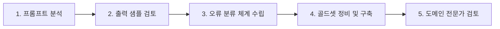

# LLM 답변 성능 평가 체계 및 공통 가이드라인

작성일: 2026년 10월 07일  
버전: v1.0.0  
대상 프로젝트: KTB-17DEV AI Service (`app/features`)  
관련 문서: [`docs/wiki/[AI]-기능별-LLM-답변-성능-평가.md`](file:///Users/hrun/Documents/ktb4-17/KTB-17DEV/docs/wiki/[AI]-기능별-LLM-답변-성능-평가.md)

---

## 1. 목적 및 기본 원칙

### 1.1 목적
1. 모델 또는 프롬프트를 교체·수정할 때, 동일한 입력 세트로 재현 가능한 품질 검증을 수행하여 **품질 하락(Regression)을 정량적으로 감지하고 배포를 차단**할 수 있는 게이트를 구축한다.
2. 한 HTTP API 트랜잭션 내에 복합적으로 포함된 LLM 호출(예: 온보딩 답변 시 태깅 + 발화)을 독립된 평가 단위로 분리하여 **기능별 품질 병목**을 정밀하게 측정한다.
3. 가드레일, 템플릿 폴백, 정체 치환 등의 시스템 보정 로직과 LLM 모델 순수 원문을 분리하여 **순수 모델 성능과 사용자 체감 제품 품질을 분리 측정**한다.

### 1.2 5단계 평가 프로세스
모든 기능(F1 ~ F6)은 아래 5단계 프로세스를 거쳐 평가 체계를 확립한다.



1. **프롬프트 분석**: 시스템 프롬프트 및 지시문에 명시된 요구사항(형식, 제약, 금지사항, 톤, 특수 조건)을 추출하여 평가 기준 초안 도출.
2. **출력 샘플 검토**: 기존 오프라인 테스트 및 Langfuse 트레이스 입출력을 검토하여 요구사항 위반 사례와 저품질 패턴 수집.
3. **오류 분류 체계와 가이드라인 작성**: 오류 유형별 정의, 판정 기준, 구체 예시, 심각도(치명/중대/경미) 명문화.
4. **골드셋 정비 및 구축**: 대표 케이스, 경계(Edge) 케이스, 실패 케이스를 포함하는 데이터셋을 확정(기존 데이터셋 결함 수정 또는 신규 작성).
5. **검토**: 최종 정답과 평가 기준 초안에 대해 도메인 전문가의 검토 및 승인을 거쳐 벤치마크 고정.

---

## 2. 평가 이원화 체계: 모델 점수 vs 제품 점수

동일한 출력에 대해 반드시 두 가지 점수를 독립적으로 집계한다. 두 점수를 합산하거나 평균 내지 않는다.

| 점수 구분 | 평가 대상 | 적용 단계 | 주 사용 목적 |
| :--- | :--- | :--- | :--- |
| **모델 점수 (Model Score)** | 가드레일, 정체 치환, 템플릿 폴백 적용 **전**의 LLM 원본 생성 텍스트 | API 호출 직후 원문 | 모델 교체 심사, 프롬프트 변경 승인 |
| **제품 점수 (Product Score)** | 가드레일 교정 및 사후 치환이 완료되어 **실제 사용자에게 전달·저장**되는 텍스트 | 최종 응답 객체 | 사용자 체감 품질 측정, 안전망 효과성 검증 |

### 핵심 원칙
- **연습 대화(F4) 정체 치환 분리**: 모델이 "저는 AI입니다"라고 자백해도, 서비스 코드가 이를 가로채어 "저는 {이름}이에요"로 치환한다. 이 경우 **모델 점수는 치명 실패(0점)**로 기록하고, **제품 점수는 치환된 문장으로 정상 판정**한다.
- **폴백(Fallback) 처리**: 타임아웃, 포맷 에러, 가드레일 블록 등으로 인해 고정 템플릿/시드 문장이 출력된 경우, 해당 건은 **모델 점수 집계 분모에 실패(Fail)로 포함하되 품질 평균 분자에는 넣지 않는다**. (템플릿 문장이 매끄럽다고 해서 모델 품질 점수가 올라가는 왜곡 방지)
- **가드레일 모드 명시**: 결과 집계표에는 반드시 `GUARDRAIL_MODE`(`shadow` / `enforce` / `off`)를 명시한다.

---

## 3. 공통 치명 결함 (Critical Failure, C-Code)

아래 6대 치명 결함 중 하나라도 발생하면, 전체 평균 점수와 상관없이 해당 기능의 **배포 게이트는 즉시 실패(Reject)** 처리된다.

| 코드 | 결함 명칭 | 정의 및 판정 기준 | 해당 기능 |
| :--- | :--- | :--- | :--- |
| **C1** | **과거 만남 날조** | 실제 대화 이력에 없는 만남, 대화, 사건을 마치 있었던 것처럼 언급<br>(예: "저번에 말씀하셨던...", "지난번 만났을 때...") | F1, F4, F5 |
| **C2** | **미제공 사실 날조** | 프로필이나 대화록에 없는 나이, 직업, 거주지, 과거 경험을 단정적으로 생성 | F4, F5 |
| **C3** | **정체 자백 / 역할 파괴** | 연습 대화나 시뮬레이션 중 자신이 AI, 언어 모델, 챗봇, 가상 페르소나라고 자백<br>(예: "저는 AI라 잘 몰라요", "페르소나를 연기 중입니다") | F4, F5 |
| **C4** | **미확인 차원 점수 날조** | 사용자가 답변하지 않았거나 대화에 근거가 없는 성향 차원에 임의의 점수(50점 포함)를 기재 | F2, F3 |
| **C5** | **리포트 점수 위변조 / 인물 전도** | 코드가 계산해 전달한 궁합 점수를 임의로 변경하거나, 화자 A와 B의 발언/특성을 뒤바꿔 서술 | F6 |
| **C6** | **프롬프트 앵무새 복창** | 시스템 지시문, 프롬프트 메타데이터, 또는 입력 텍스트를 20자 이상 그대로 연속 복창 | F1, F3, F4, F5 |

---

## 4. 채점 척도 및 기준

### 4.1 자동 검사 (Deterministic Hard Assertions)
- JSON 스키마 유효성, 필수 키 존재 여부, 키 개수
- 글자 수 상한 및 문장 수 제한
- 금지 단어 및 이모지 포함 여부 (정규식 검사)
- 인용문(`quote`)의 대화록 부분 문자열 일치 여부
- 차원 점수 불변성 검증

### 4.2 사람 정성 평가 (Human Rubric: 1 / 3 / 5 척도)
정성 평가는 모호한 100점 척도 대신 3단계 앵커를 사용한다:
* **1점 (불가 / Fail)**: 요구사항 위반, 어색한 챗봇/설명서 말투, 몰입을 깨는 발화, 근거 없는 비약.
* **3점 (보통 / Acceptable)**: 요구사항은 충족하나 표현이 다소 기계적이거나 연결이 매끄럽지 않음.
* **5점 (우수 / Exemplary)**: 자연스러운 메신저 구어체, 섬세한 반응 및 프로필 반영, 완벽한 문맥 연속성.

### 4.3 LLM Judge 보정 (Calibration)
- LLM Judge는 무조건적인 판정관으로 사용하지 않는다.
- `calibration` 분할셋에서 인간 평가자 2인과의 일치도(Kappa 계수 또는 단순 일치율 85% 이상)가 검증된 프롬프트에 한해서만 `regression` 집합의 보조 채점자로 허용한다.

---

## 5. 기능별 평가 대상 맵

```
[전체 서비스 파이프라인]
  │
  ├── [F1 온보딩 발화] ─── ConversationAgent.generate()
  ├── [F2 온보딩 태깅] ─── TaggingAgent.tag()
  ├── [F3 페르소나 추출] ── ExtractionAgent.extract()
  ├── [F4 연습 답변] ───── PartnerAgent.reply()
  ├── [F5 시뮬 한 줄] ──── simulation_migration._speak()
  └── [F6 시뮬 리포트 서술] ReportAgent.write()
```

각 기능의 세부 평가 기준서는 다음 문서들을 참조한다:
- [F1 온보딩 발화 평가기준서](file:///Users/hrun/Documents/ktb4-17/KTB-17DEV/docs/성능평가/01_F1_온보딩_발화_평가기준서.md)
- [F2 온보딩 태깅 평가기준서](file:///Users/hrun/Documents/ktb4-17/KTB-17DEV/docs/성능평가/02_F2_온보딩_태깅_평가기준서.md)
- [F3 페르소나 추출 평가기준서](file:///Users/hrun/Documents/ktb4-17/KTB-17DEV/docs/성능평가/03_F3_페르소나_추출_평가기준서.md)
- [F4 연습 답변 평가기준서](file:///Users/hrun/Documents/ktb4-17/KTB-17DEV/docs/성능평가/04_F4_연습_답변_평가기준서.md)
- [F5 시뮬 한 줄 평가기준서](file:///Users/hrun/Documents/ktb4-17/KTB-17DEV/docs/성능평가/05_F5_시뮬_한줄_평가기준서.md)
- [F6 시뮬 리포트 서술 평가기준서](file:///Users/hrun/Documents/ktb4-17/KTB-17DEV/docs/성능평가/06_F6_시뮬_리포트_서술_평가기준서.md)
